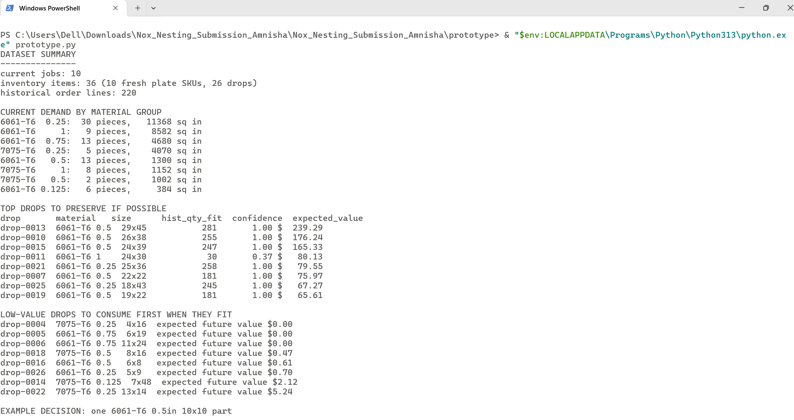

# Nox Metals Nesting Design Challenge Submission

Candidate: Amnisha

## Contents

- `design_doc.pdf` - main design pdf for review.
- `prototype/prototype.py` - small Python prototype demonstrating demand-aware drop valuation.
- `prototype/output_example.txt` - example output from the prototype against the provided data.
- `jobs.json`, `inventory.json`, `order_history.json`, `DATA.md` - provided sample data, included for reproducibility.

## Prototype scope

The prototype is intentionally narrow. It does not implement a production 2D nesting solver. Instead, it demonstrates the judgment-heavy part of the challenge: valuing drops as uncertain future inventory using historical demand.

In particular, it:

1. Summarizes the current jobs by alloy/thickness.
2. Scores existing drops by how many historical orders of matching alloy/thickness could fit inside them, allowing 90-degree rotation.
3. Applies a confidence discount when only a few historical order lines support the estimate.
4. Shows an example decision for a 6061-T6, 0.5-inch, 10x10 part, where the best drop to consume is not necessarily the largest fitting drop.

## How to run

From this folder:

```bash
cd prototype
python prototype.py --jobs ../jobs.json --inventory ../inventory.json --history ../order_history.json
```

Expected output

and is also saved in `prototype/output_example.txt`.

## Design intent

The central design choice is to optimize for expected business cost, not simply today's visible material waste. A reusable offcut/drop is treated as an uncertain inventory asset: it is valuable only when future demand is likely to use it, and the estimate should be discounted when history is thin.
